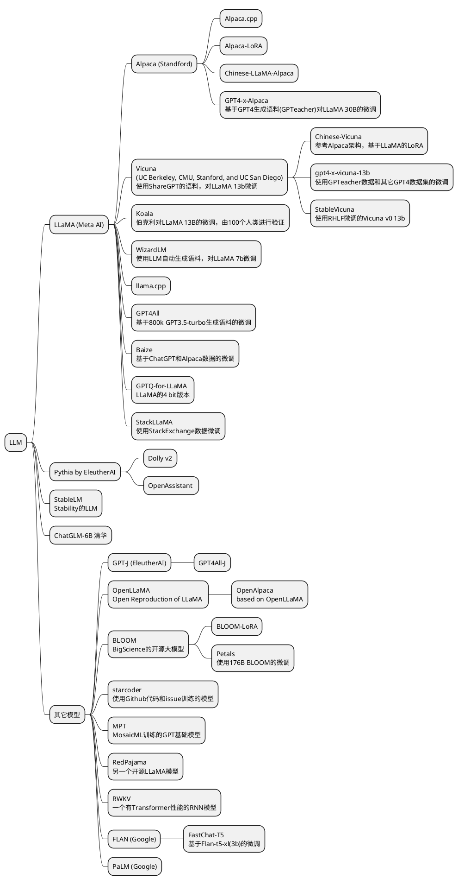

+++
draft = false
toc = false
date = "2023-05-22T14:15:50+08:00"
title = "Open Source LLM"
+++

### 排名

基于[lmsys arena](https://chat.lmsys.org/?arena)

| Rank | Name                    |
|------|-------------------------|
| 1    | vicuna-13b              |
| 2    | koala-13b               |
| 3    | RWKV-4-Raven-14B        |
| 4    | oasst-pythia-12b        |
| 5    | chatglm-6b              |
| 6    | stablelm-tuned-alpha-7b |
| 7    | alpaca-13b              |
| 8    | fastchat-t5-3b          |
| 9    | dolly-v2-12b            |
| 10   | llama-13b               |

### 继承关系

